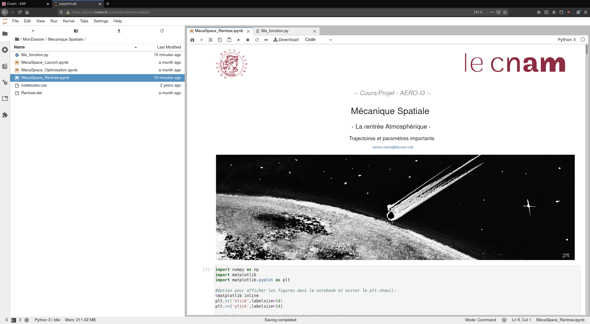

L'environnement Jupyter permet de travailler dans 2 principales interfaces. La
première dite "**tree**" permet d'accéder rapidement et simplement aux carnets
d'un dossier et constitue l'interface d'origine de Jupyter. La seconde
interface dite "**Lab**" est un environnement plus riche permettant l'utilisation de
nombreux outils pour interagir avec les carnets, leurs options et leur
contenus.

Cette page présente rapidement les deux interfaces.

# L'interface de travail basique "Tree"

Cette première interface est l'environnement de travail d'origine de Jupyter et
permet une utilisation simple et efficace des carnets. Par défaut, à l'ouverture
du liens Jhub dans moodle, votre navigateur arrive à la racine du gestionnaire de fichier.
L'interface est alors majoritairement pilotée par le navigateur qui ouvrira un
nouvel onglet si vous cliquez sur un nouveau document (carnets, data,
images...)

Avec cette interface, il est possible de visualiser et d'exécuter simplement les
carnets. Le menu horizontal permet de sélectionner certaines options afin
d'interagir avec les carnets (sauvegarde, fermeture, exécution par
cellules...).

# L'interface de travail avancée "JupyterLab"

Cette interface est un environnement de travail complet (type IDE) permettant la
personnalisation de nombreux paramètres (comme le thème ou l'éditeur de texte)
et dont tous les documents sont gérés dans un même onglet du navigateur. Cette
interface possède donc ses propores onglet dans lesquels vous pouvez naviguez
librement.

Avec cette interface, il est possible de visualiser et d'exécuter simplement les
carnets mais aussi d'interagir avec les fichiers via un terminal, d'éditer des
fichiers textes avec l'éditeur de votre choix (vim, sublimetext...), des
modifier rapidement des fichiers images, d'accéder facilement à la documentation
ainsi qu'aux nombreuses extensions disponibles (widgets, git, latex, autoplay,
hicode, ....). 

Le menu latéral permet d'accéder rapidement aux différentes fonctionnalités:

 **Gestionnaire de Fichier** :
Affiche le contenu d'un dossier.

 **Gestionnaire des taches**:
Affiche les travaux en cours (noyaux ouverts)

 **Commandes**: Liste de commandes possibles et
accès à la documentation.

 **Gestionnaire de
propriétés**: Gérer les propriétés des cellules d'un carnets (type code ou type
markdown)

 **Onglets ouverts**: liste des tous les
onglets ouverts.

 **Gestionnaire d'extensions**:
permet d'installer/gérer les nombreuses extensions.

